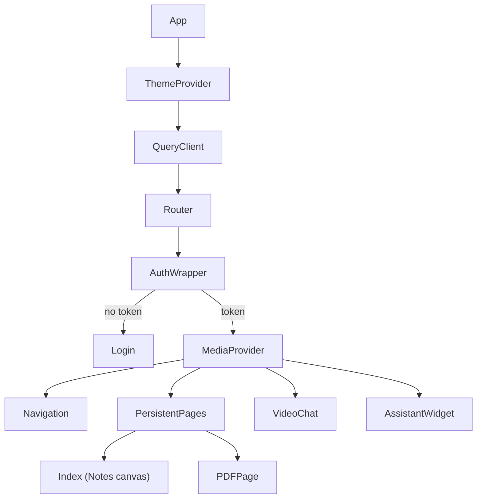
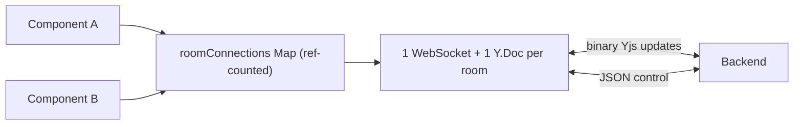

# Architecture — Vani Frontend

React 18 + Vite SPA for the Vani/Chanakya collaborative notes/PDF editor. It pairs
with the [backend](https://github.com/KunalBharadwaj/Vani_Backend) over REST +
a single WebSocket. This document covers the app's structure and its non-obvious
decisions.

## App shell & routing

**Persistent pages, not route-swapped.** Both the Notes canvas and the PDF editor
stay mounted for the whole session; the router only toggles which one is visible.
Hidden pages use `visibility:hidden` + `position:fixed` (see `hiddenStyle` in
`App.jsx`), **not** `display:none`, because react-pdf/canvas elements lose their
rendered bitmap inside a `display:none` container. This preserves in-progress
drawings and annotations across navigation.

## Authentication (`AuthWrapper`)

- The JWT lives in `localStorage` (`vani_auth_token`) and is provided app-wide via
  `AuthContext`.
- On return from Google OAuth, the URL carries only a CSRF **nonce** (never the
  token). `AuthWrapper` verifies the nonce against `sessionStorage`, then exchanges
  the httpOnly cookie for the token via `GET /api/auth/me`.
- Silent re-auth: on load with no token it tries the same cookie exchange, so a
  returning user with a valid session skips the login screen.

## Realtime collaboration (`hooks/useCollaboration.js`)

This hook is the heart of the client. Multiple components (`PDFMerged`,
`MediaContext`, …) need the same room connection, so connections are **pooled and
ref-counted** in a module-level `Map` keyed by `roomId` — one WebSocket and one
`Y.Doc` per room no matter how many components subscribe.

Key behaviors:
- **Auth handshake** on open (`{type:"auth", token}`), then `join`.
- **Local edits** propagate via `doc.on("update")` → sent as binary frames (unless
  the update originated remotely, to avoid echo loops).
- **Reconnect** with exponential backoff (capped at 10s) while any subscriber
  remains.
- **Session expiry:** a **4001** close (invalid/expired token) stops reconnecting,
  clears the token, and returns to login — no infinite reconnect storm.
- **Anti-entropy:** every 10s it sends a `sync_step_1` state vector and applies the
  `sync_step_2` diff the server returns.
- Cleanup decrements the ref count and tears down the socket/doc when it hits zero.

Consumers get `{ ydoc, pagesMap, pdfMap, status, roomState, sendWsMessage }`.

## Audio / video (`context/MediaContext.jsx`)

A single module-level Agora client is shared for the app's lifetime. `MediaContext`
fetches a per-room RTC token from the backend, joins the Agora channel on demand,
and tracks remote publishers. Call **invitations** ("ring") are sent over the
collaboration WebSocket (`webrtc:*`); the actual media streams go through Agora,
not our server. Incoming calls surface a lightweight accept/decline banner.

## AI assistant (`components/ai/AssistantWidget.jsx`)

A draggable floating panel that talks to the backend AI routes (with the auth
header). The panel's positioning geometry is extracted into the pure, unit-tested
`lib/panelPosition.js` so it anchors to its button and never drifts off-screen.

## Local storage (`services/storageService.js`)

Drawings are stored in the browser via **IndexedDB** and can be exported to PNG or
multi-page PDF (pdf-lib) or written to disk with the File System Access API.

## Testing & tooling

- **Vite** build, **Tailwind** + **shadcn/ui**, installable as a **PWA**.
- **Vitest** (jsdom) covers the panel geometry and the IndexedDB storage layer;
  see `src/**/*.test.{js,jsx}`.
- CI (GitHub Actions) runs lint → test → build on every push/PR.

## Directory map

| Path | Responsibility |
|------|----------------|
| `src/App.jsx` | Providers, routing, auth gate, persistent pages |
| `src/hooks/useCollaboration.js` | Pooled WS + Yjs client |
| `src/context/MediaContext.jsx` | Agora audio/video + call signaling |
| `src/context/ThemeContext.jsx` | Light/dark theme |
| `src/components/pdf/PDFMerged.jsx` | PDF viewing/annotation editor |
| `src/components/paint/` | Notes canvas engine + tools |
| `src/components/ai/AssistantWidget.jsx` | Chanakya assistant panel |
| `src/components/shared/` | Room dashboard, video chat, banners |
| `src/services/storageService.js` | IndexedDB + export helpers |
| `src/lib/panelPosition.js` | Pure panel-positioning geometry |
